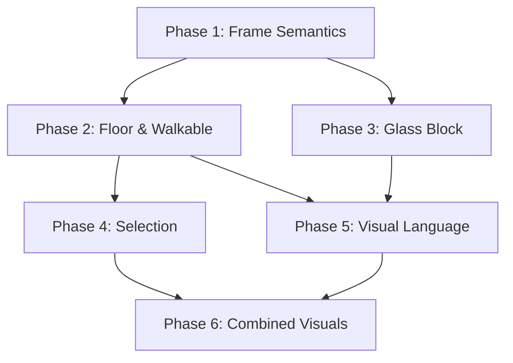

# Laser Potato — MVP Implementation Plan (Detailed Briefs)

> **Generated**: 2026-08-31
> **Status**: Ready for agent execution
> **Phases**: 6 active (Phase 7 deferred post-MVP)

---

## Table of Contents

1. [Architecture Overview](#architecture-overview)
2. [Phase 1 — Frame Semantics & Window Resize](#phase-1)
3. [Phase 2 — Floor Tiles, Level Size & Lock Floor](#phase-2)
4. [Phase 3 — Glass Block & Walkable Surfaces](#phase-3)
5. [Phase 4 — Selection Overhaul](#phase-4)
6. [Phase 5 — Visual Language](#phase-5)
7. [Phase 6 — Combined Block Visuals](#phase-6)
8. [Solver Functional Equivalence](#solver-equivalence)
9. [Phase 7 — Block Creation Factory (Post-MVP)](#phase-7)
10. [Dependency Graph & Parallelization](#dependencies)

---

## Architecture Overview <a name="architecture-overview"></a>

The codebase is split into two layers:

1. **Pure Logic Engine** (no Bevy): `src/lib.rs`, `src/sim.rs`, `src/turn.rs`, `src/laser.rs`, `src/block_types.rs`, `src/level.rs`, `src/solver/`
2. **Bevy Application**: `src/main.rs`, `src/render.rs`, `src/input.rs`, `src/editor/` (mod.rs, ui.rs, camera.rs)

**Key types**:
- `Body` (sim.rs:377-384): `{id, kind, anchor, orientation, shape: Vec<IVec3>, tags}`
- `BlockKind` (block_types.rs:298-317): `Player | Wall | Pushable | Mirror | LaserSource | Goal`
- `BlockProperties` (block_types.rs:185-201): `{is_pushable, is_solid, is_player_controlled, emits_laser_towards, movement_priority, faces: [FaceProperties; 6]}`
- `FaceProperties` (block_types.rs:102-109): `{reflects_towards: Option<IVec3>}`
- `TurnEngine` (turn.rs:134-149): `{world, laser_state, outcome, undo_stack, initial_world, raw_world, validation_error}`
- `EditorState` (editor/mod.rs:67-116): `{selected_kind, is_fixed, z_mode, current_z, selected_body_id, ...}`
- `RenderAssets` (render.rs:40-76): Pre-created mesh/material handles

**Coordinate convention**: Sim (X, Y, Z) → Bevy (X, Z_sim, -Y). Function `sim_to_bevy()` in render.rs handles this.

---

## Phase 1 — Frame Semantics & Window Resize <a name="phase-1"></a>

### Objective
Formalize the `n / n*` frame naming convention, display both Frame 0* (editing state) and Frame 1 (preview) in the editor, detect invalid levels when Frame 1 resolution causes spontaneous block movement, and ensure the window is resizable.

### Files to Modify

| File | Changes |
|:---|:---|
| `src/turn.rs` | Rename fields, add accessors, tighten validation |
| `src/editor/mod.rs` | Dual display logic, recompute preview on edits |
| `src/editor/ui.rs` | Preview toggle button, invalid-level error banner |
| `src/main.rs` | Verify window resizable config |

### Detailed Implementation

#### 1.1 Rename Internal Terminology (turn.rs)

In `TurnEngine` (turn.rs:134-149):

```rust
pub struct TurnEngine {
    /// Frame 1 and beyond: the active resolved simulation state.
    pub world: World,
    pub laser_state: Vec<LaserSegment>,
    pub outcome: GameOutcome,
    undo_stack: Vec<World>,
    initial_world: World,
    /// Frame 0*: the raw authoring state (partially resolved, what you edit).
    pub frame_zero_star: World,       // renamed from raw_world
    /// Frame 1 preview: the fully resolved initial state.
    pub frame_one_preview: Option<World>,  // NEW: None if invalid
    /// Frame 1 preview laser state
    pub frame_one_lasers: Vec<LaserSegment>,  // NEW
    pub validation_error: Option<String>,
}
```

Update all references to `raw_world` → `frame_zero_star` throughout the codebase:
- `turn.rs` lines 146, 156-201, 204-217, 263-271, 767-768
- `editor/mod.rs` (search for `raw_world`)
- Any level save/load paths that reference `raw_world`

Update `compute_frame_zero()` (turn.rs:156):
- Rename to `resolve_frame_one()` 
- Return signature stays the same: `(World, Vec<LaserSegment>, GameOutcome, Option<String>)`
- The function takes the frame 0* world and produces the frame 1 state

Update `TurnEngine::new()` (turn.rs:204-217):
```rust
pub fn new(world: World) -> Self {
    let frame_zero_star = world.clone();
    let (frame1_world, laser_state, outcome, validation_error) = resolve_frame_one(&frame_zero_star);
    let frame_one_preview = if validation_error.is_none() {
        Some(frame1_world.clone())
    } else {
        None
    };
    Self {
        world: frame1_world,
        laser_state: laser_state.clone(),
        outcome,
        undo_stack: Vec::new(),
        initial_world: frame1_world.clone(), // keep for reset
        frame_zero_star,
        frame_one_preview,
        frame_one_lasers: laser_state,
        validation_error,
    }
}
```

Update `reset()` (turn.rs:262-271): use `frame_zero_star` instead of `raw_world`.

#### 1.2 Editor Dual Display (editor/mod.rs)

The editor already modifies `game.engine.world` directly (the raw/frame0* world). When editing, blocks must always display from frame 0*. The frame 1 preview is a read-only overlay.

In `EditorState` (editor/mod.rs:67), add:
```rust
/// Whether to show the Frame 1 preview overlay (lasers, resolved positions).
pub show_frame1_preview: bool,  // default: true
```

When `show_frame1_preview` is true AND `validation_error` is None:
- Render laser beams from `engine.frame_one_lasers` instead of recomputing
- Show a semi-transparent "preview" indicator

When editing any block (placement, drag, rotate, delete, etc.):
- Re-run `resolve_frame_one()` to update the preview
- If it produces a validation error, set `show_frame1_preview = false` and show error toast

Add a helper method to `EditorState` or as a free function in editor/mod.rs:
```rust
fn refresh_frame1_preview(engine: &mut TurnEngine) {
    let (preview_world, lasers, outcome, err) = resolve_frame_one(&engine.frame_zero_star);
    engine.frame_one_preview = if err.is_none() { Some(preview_world.clone()) } else { None };
    engine.frame_one_lasers = lasers;
    engine.validation_error = err;
    // Also update the active world for playtest readiness:
    engine.world = preview_world;
    engine.outcome = outcome;
}
```

Call this after every edit operation (block place, delete, rotate, move, toggle fixed, etc.).

#### 1.3 Invalid Level Detection

The current `compute_frame_zero()` already checks for spontaneous movement (turn.rs:177-198). This logic needs to be extended to also catch push-chain movements:

In `resolve_frame_one()`, after the fixpoint loop:
```rust
// Check if any body moved from frame 0* to frame 1
// (existing check already does this - just ensure it captures push chain movements too)
```

In editor/ui.rs, when `engine.validation_error.is_some()`:
- Display a red error banner: "⚠ Level invalid — blocks move spontaneously. No Frame 1 preview."
- Grey out the "Test Play" and "Test with Solution" buttons

#### 1.4 Window Resize

In `main.rs:142-148`, the window config is:
```rust
Window {
    title: "Laser Potato - Level Editor & Engine".into(),
    resolution: (1200, 800).into(),
    ..default()
}
```

Bevy 0.19 windows are resizable by default (`Window.resizable` defaults to `true`). Verify this is not overridden.

Check `editor/ui.rs` for hardcoded pixel widths that would break on resize:
- Line 447: `cursor_pos.x < 260.0` — this is the left sidebar width check. If the sidebar uses `Val::Px(250.0)`, this is fine as long as the sidebar stays fixed-width.
- Line 451: `cursor_pos.x > (window.width() - 260.0)` — already dynamic, good.
- Line 455: `cursor_pos.y < 55.0` — top bar height, fixed is fine.
- **Main workspace panel** (ui.rs:190-197): Uses `Val::Percent(100.0)` — already responsive. ✅

No major changes needed for resize, but verify by running at different window sizes.

### Acceptance Criteria

- [ ] `raw_world` renamed to `frame_zero_star` everywhere; `compute_frame_zero` renamed to `resolve_frame_one`
- [ ] All existing tests pass with renamed fields
- [ ] Editor shows frame 0* blocks during editing, frame 1 lasers as preview
- [ ] Placing a block that causes spontaneous movement shows error toast, hides preview
- [ ] Window can be resized; UI layout doesn't break at 800x600 or 1920x1080
- [ ] `cargo test` passes with no regressions

---

## Phase 2 — Floor Tiles, Level Size & Lock Floor <a name="phase-2"></a>

### Objective
Add a Floor block type, a "Floorplan" popup to batch-fill a Z-layer with floor blocks, and a "Lock Floor" button to prevent accidentally selecting floor tiles.

### Files to Modify

| File | Changes |
|:---|:---|
| `src/block_types.rs` | Add `BlockKind::Floor`, add `walkable` to `FaceProperties` |
| `src/level.rs` | Update serialization for new BlockKind |
| `src/render.rs` | Floor mesh/material, add to `RenderAssets` and `sync_bodies` |
| `src/editor/mod.rs` | Lock floor layer logic, filter locked layers from raycasting |
| `src/editor/ui.rs` | Floorplan popup, Lock Floor button, Floor in palette |

### Detailed Implementation

#### 2.1 Add `walkable` to FaceProperties (block_types.rs)

In `FaceProperties` (block_types.rs:102-109):
```rust
#[derive(Clone, Copy, Debug, PartialEq, Eq, Hash, Serialize, Deserialize)]
pub struct FaceProperties {
    pub reflects_towards: Option<IVec3>,
    /// Whether a player/entity can stand on this face.
    pub walkable: bool,  // NEW
}
```

Update `Default` impl (block_types.rs:111-117):
```rust
impl Default for FaceProperties {
    fn default() -> Self {
        Self {
            reflects_towards: None,
            walkable: true,  // most faces are walkable by default
        }
    }
}
```

Update `FaceProperties::none()` (block_types.rs:121-125):
```rust
pub const fn none() -> Self {
    Self { reflects_towards: None, walkable: true }
}
```

Add a non-walkable constructor:
```rust
pub const fn non_walkable() -> Self {
    Self { reflects_towards: None, walkable: false }
}
```

Update `FaceProperties::reflects_to()` (block_types.rs:128-132):
```rust
pub const fn reflects_to(out_dir: IVec3) -> Self {
    Self { reflects_towards: Some(out_dir), walkable: false }  // reflective faces aren't walkable
}
```

Update `transform()` and `reflect_across_plane()` to carry `walkable` through:
```rust
pub fn transform(&self, rot: &CubeRot) -> Self {
    Self {
        reflects_towards: self.reflects_towards.map(|d| rot.apply(d)),
        walkable: self.walkable,
    }
}
```

#### 2.2 Set Walkable Per BlockKind (block_types.rs)

In `BlockKind::default_properties()` (block_types.rs:321-358):

For **Player**: all faces walkable (default). No change needed.

For **Wall**: all faces walkable (default). No change needed.

For **Pushable**: all faces walkable (default). No change needed.

For **Goal**: NO faces walkable. Add:
```rust
Self::Goal => {
    props.is_pushable = true;  // NOW MOVEABLE (per user requirement)
    props.movement_priority = 100;
    // No face is walkable on a goal block
    for face in BlockFace::ALL {
        props.faces[face as usize].walkable = false;
    }
}
```

For **Mirror**: 2 walkable back faces. The reflective faces (`NegY`, `PosX`) and hypotenuse caps (`PosZ`, `NegZ`) are not walkable. The flat back faces (`NegX`, `PosY`) are walkable:
```rust
Self::Mirror => {
    // ... existing reflection setup ...
    // Back faces (NegX=West wall, PosY=North wall) are walkable flat surfaces
    props.faces[BlockFace::NegX as usize].walkable = true;
    props.faces[BlockFace::PosY as usize].walkable = true;
    // Reflective hypotenuse faces are NOT walkable
    props.faces[BlockFace::NegY as usize].walkable = false;
    props.faces[BlockFace::PosX as usize].walkable = false;
    // Top and bottom caps
    props.faces[BlockFace::PosZ as usize].walkable = false;
    props.faces[BlockFace::NegZ as usize].walkable = false;
}
```

For **LaserSource**: all faces walkable EXCEPT the emitting face (NegY → local +Y emission):
```rust
Self::LaserSource => {
    // ... existing setup ...
    // The face that the laser exits from is not walkable (PosY in local space = emission direction)
    props.faces[BlockFace::PosY as usize].walkable = false;
}
```

#### 2.3 Add BlockKind::Floor (block_types.rs)

Add to the enum (block_types.rs:298-317):
```rust
pub enum BlockKind {
    Player,
    Wall,
    Pushable,
    Mirror,
    LaserSource,
    Goal,
    /// Floor tile — behaves like a Wall but gets special editor treatment.
    Floor,  // NEW
}
```

Add properties:
```rust
Self::Floor => {
    props.is_pushable = false;
    props.movement_priority = 100;
    // All faces walkable (same as Wall)
}
```

Add Display impl:
```rust
Self::Floor => write!(f, "Floor"),
```

**Important**: Update `Serialize`/`Deserialize` — since `BlockKind` derives both, adding a variant will automatically work, but OLD level files won't have `Floor`. Ensure `to_world()` in level.rs handles this gracefully. Since serde_json will just fail to deserialize unknown variants, this is fine — old files don't have Floor blocks.

#### 2.4 Floor Rendering (render.rs)

Add to `RenderAssets`:
```rust
pub floor_mat: Handle<StandardMaterial>,
```

In `setup_render_assets()`, add:
```rust
// Floor tiles: muted slate grey with a subtle grid pattern
floor_mat: materials.add(StandardMaterial {
    base_color: Color::srgb(0.35, 0.38, 0.42),  // Slightly bluer than walls
    base_color_texture: Some(stone_texture.clone()),
    perceptual_roughness: 0.9,
    cull_mode: None,
    double_sided: true,
    ..default()
}),
```

In `sync_bodies()` (render.rs:675-841), add match arms for `BlockKind::Floor`:
```rust
BlockKind::Floor => {
    mat_handle.0 = assets.floor_mat.clone();
}
```
And in the spawn section:
```rust
BlockKind::Floor => (assets.cube_mesh.clone(), assets.floor_mat.clone()),
```

#### 2.5 Editor Palette & Floorplan Popup (editor/ui.rs, editor/mod.rs)

Add `Floor` to the palette in `setup_editor_ui()` alongside the other block buttons.

In `EditorState::allowed_fixed_state()` (editor/mod.rs:121-127):
```rust
BlockKind::Floor => (false, true),  // Floor is always fixed/stationary
```

**Floorplan Popup**: Add new UI components in `editor/ui.rs`:

```rust
#[derive(Component)]
pub struct FloorplanPopup;

#[derive(Component)]
pub struct FloorplanWidthInput;

#[derive(Component)]
pub struct FloorplanHeightInput;

#[derive(Component)]
pub struct FloorplanZInput;

#[derive(Component)]
pub struct FloorplanFillButton;
```

Add floorplan state to `EditorState`:
```rust
pub floorplan_open: bool,
pub floorplan_width: i32,    // default 10
pub floorplan_height: i32,   // default 10
pub floorplan_z: i32,        // default -1
```

The "Fill Floor" button handler in `editor/mod.rs`:
```rust
fn fill_floorplan(world: &mut World, width: i32, height: i32, z: i32) {
    // Remove any existing Floor blocks at the target Z level
    let existing_floor_ids: Vec<BodyId> = world.bodies()
        .iter()
        .filter(|b| b.kind == BlockKind::Floor && b.anchor.z == z)
        .map(|b| b.id)
        .collect();
    for id in existing_floor_ids {
        world.despawn(id);
    }
    // Fill the rectangle (0,0) to (width-1, height-1) at z
    for x in 0..width {
        for y in 0..height {
            let id = world.spawn(BlockKind::Floor, IVec3::new(x, y, z), vec![IVec3::ZERO]);
            if let Some(b) = world.body_mut(id) {
                b.tags.set(TagKind::Fixed, TagValue::Unit);
            }
        }
    }
    world.sync_grid();
}
```

#### 2.6 Lock Floor (editor/mod.rs)

Add to `EditorState`:
```rust
pub locked_z_layers: std::collections::HashSet<i32>,
```

Add a "Lock Floor" toggle button in the UI. When toggled:
- `editor.locked_z_layers.insert(editor.floorplan_z)` or `.remove()`

Filter locked layers from selection/interaction in `editor_grid_interaction_system()`:

In the FixedLayer branch (editor/mod.rs:471-478), after finding `body_id`:
```rust
let body_id = game.engine.world.body_at(cell).map(|b| b.id)
    .filter(|&id| {
        // Don't select bodies on locked Z layers
        let body = game.engine.world.body(id).unwrap();
        !editor.locked_z_layers.contains(&body.anchor.z)
    });
```

In the StackOnTop branch, filter similarly in `raycast_stack_on_top()` or after the result:
```rust
let clicked_body_id = clicked_body_id.filter(|&id| {
    let body = game.engine.world.body(id).unwrap();
    !editor.locked_z_layers.contains(&body.anchor.z)
});
```

Also filter locked layers from right-click delete and keyboard shortcuts on selected body.

### Acceptance Criteria

- [ ] `BlockKind::Floor` exists with correct properties (not pushable, all faces walkable)
- [ ] `FaceProperties` has `walkable: bool` field
- [ ] All existing `BlockKind` variants have correct walkable settings per the MVP roster table
- [ ] Floor blocks render with a distinct muted color
- [ ] Floorplan popup lets user set W, H, Z and fills floor blocks
- [ ] "Lock Floor" toggle prevents selecting/dragging blocks on the locked Z layer
- [ ] `Goal` is now moveable by default (no `Fixed` tag required)
- [ ] All existing tests pass; add new tests for Floor properties
- [ ] Serialization round-trip works for levels with Floor blocks

---

## Phase 3 — Glass Block & Laser Passthrough <a name="phase-3"></a>

### Objective
Add a transparent glass block that lasers pass straight through.

### Files to Modify

| File | Changes |
|:---|:---|
| `src/block_types.rs` | Add `BlockKind::Glass`, add `transmits_laser: bool` to FaceProperties |
| `src/laser.rs` | Handle laser transmission through glass |
| `src/render.rs` | Translucent glass material and mesh |
| `src/editor/mod.rs` | Glass in allowed_fixed_state |
| `src/editor/ui.rs` | Glass in palette |
| `src/level.rs` | Serialization support (automatic via serde) |

### Detailed Implementation

#### 3.1 Add Laser Transmission to FaceProperties (block_types.rs)

```rust
#[derive(Clone, Copy, Debug, PartialEq, Eq, Hash, Serialize, Deserialize)]
pub struct FaceProperties {
    pub reflects_towards: Option<IVec3>,
    pub walkable: bool,
    /// If true, laser passes straight through this face without stopping.
    pub transmits_laser: bool,  // NEW
}
```

Update defaults:
```rust
impl Default for FaceProperties {
    fn default() -> Self {
        Self { reflects_towards: None, walkable: true, transmits_laser: false }
    }
}
```

Update constructors, `transform()`, `reflect_across_plane()` to carry `transmits_laser`.

#### 3.2 Add BlockKind::Glass (block_types.rs)

```rust
pub enum BlockKind {
    // ... existing ...
    /// Transparent glass block — lasers pass straight through.
    Glass,
}
```

Properties:
```rust
Self::Glass => {
    props.is_pushable = true;  // moveable by default
    props.is_solid = true;     // blocks player/pushable movement
    props.movement_priority = 100;
    // All faces transmit laser and are walkable
    for face in BlockFace::ALL {
        props.faces[face as usize].transmits_laser = true;
        props.faces[face as usize].walkable = true;
    }
}
```

Display impl: `Self::Glass => write!(f, "Glass")`.

#### 3.3 Laser Transmission (laser.rs)

In `cast_all_lasers()` (laser.rs:80-97), the current logic stops or reflects when hitting a body. Add transmission:

```rust
for _ in 0..MAX_RAY_LENGTH {
    if let Some(body) = world.body_at(current) {
        let props = body.properties();

        // Check if the struck face transmits laser
        let local_incoming = body.orientation.inverse().apply(direction);
        let struck_face = crate::block_types::BlockFace::from_incoming_ray_dir(local_incoming);

        if let Some(face) = struck_face {
            let face_props = props.face(face);
            if face_props.transmits_laser {
                // Laser passes through — record the cell but continue
                cells.push(current);
                current += direction;
                continue;  // don't stop, don't reflect
            }
        }

        // Existing reflection logic
        if let Some(reflected_dir) = props.reflect_laser(direction, &body.orientation) {
            queue.push((body.id, body.anchor, reflected_dir));
        }

        hit = Some(LaserHit { body_id: body.id, cell: current });
        break;
    }

    cells.push(current);
    current += direction;
}
```

#### 3.4 Glass Rendering (render.rs)

Add to `RenderAssets`:
```rust
pub moveable_glass_mat: Handle<StandardMaterial>,
pub fixed_glass_mat: Handle<StandardMaterial>,
```

In `setup_render_assets()`:
```rust
moveable_glass_mat: materials.add(StandardMaterial {
    base_color: Color::srgba(0.7, 0.85, 1.0, 0.25),  // Light blue tint, mostly transparent
    alpha_mode: AlphaMode::Blend,
    perceptual_roughness: 0.05,
    metallic: 0.1,
    // Subtle edge glow to make the glass visible
    emissive: LinearRgba::new(0.1, 0.15, 0.25, 1.0),
    cull_mode: None,
    double_sided: true,
    ..default()
}),
fixed_glass_mat: materials.add(StandardMaterial {
    base_color: Color::srgba(0.5, 0.55, 0.6, 0.3),
    base_color_texture: Some(stone_texture.clone()),
    alpha_mode: AlphaMode::Blend,
    perceptual_roughness: 0.1,
    cull_mode: None,
    double_sided: true,
    ..default()
}),
```

Add match arms in `sync_bodies()` for `BlockKind::Glass` (same pattern as Pushable).

#### 3.5 Editor Support

In `EditorState::allowed_fixed_state()`:
```rust
BlockKind::Glass => (true, true),  // Can be moveable or fixed
```

Add Glass to the palette in `editor/ui.rs`.

### Acceptance Criteria

- [ ] `BlockKind::Glass` exists with `transmits_laser: true` on all faces
- [ ] Laser beams pass straight through glass blocks without stopping
- [ ] Glass blocks are solid (block player movement)
- [ ] Glass renders as translucent with visible edges
- [ ] Laser beams are visually visible passing through glass
- [ ] Glass can be moveable or fixed
- [ ] New tests: laser through glass hits wall behind it, laser through 2 glass blocks works

---

## Phase 4 — Selection Overhaul <a name="phase-4"></a>

### Objective
Multi-select, box-select (FixedLayer mode only), and a "Combine" button that links selected moveable blocks into a combined group.

### Files to Modify

| File | Changes |
|:---|:---|
| `src/sim.rs` | Add `combined_group_id: Option<u32>` to Body, group-aware push chains |
| `src/turn.rs` | Update `collect_push_chain()` for combined groups |
| `src/editor/mod.rs` | Multi-select state, shift-click, box-select, combine/uncombine |
| `src/editor/ui.rs` | Combine button, selection count display |
| `src/render.rs` | Multi-select gizmos |
| `src/level.rs` | Serialize `combined_group_id` |

### Detailed Implementation

#### 4.1 Combined Group Model (sim.rs)

In `Body` (sim.rs:377-384):
```rust
pub struct Body {
    pub id: BodyId,
    pub kind: BlockKind,
    pub anchor: IVec3,
    pub orientation: CubeRot,
    pub shape: Vec<IVec3>,
    pub tags: TagSet,
    /// If Some, this body moves as a unit with all other bodies sharing the same group ID.
    /// Each body keeps its own BlockKind and state — only movement is linked.
    pub combined_group: Option<u32>,  // NEW
}
```

Update `Body::new()` to set `combined_group: None`.

Add to `World`:
```rust
next_group_id: u32,  // NEW: counter for generating unique group IDs

pub fn next_combined_group_id(&mut self) -> u32 {
    let id = self.next_group_id;
    self.next_group_id += 1;
    id
}

/// Get all body IDs in the same combined group as `body_id`.
pub fn combined_group_members(&self, body_id: BodyId) -> Vec<BodyId> {
    let group = match self.body(body_id) {
        Some(b) => b.combined_group,
        None => return vec![],
    };
    match group {
        Some(gid) => self.bodies.iter()
            .filter(|b| b.combined_group == Some(gid))
            .map(|b| b.id)
            .collect(),
        None => vec![body_id],
    }
}
```

#### 4.2 Group-Aware Push Chains (turn.rs)

Update `collect_push_chain()` (turn.rs:430-455):

```rust
fn collect_push_chain(world: &World, mover_id: BodyId, direction: IVec3) -> Option<Vec<BodyId>> {
    let mut chain = vec![mover_id];

    // If mover is in a combined group, add all group members to the chain
    if let Some(body) = world.body(mover_id) {
        if let Some(gid) = body.combined_group {
            for b in world.bodies() {
                if b.combined_group == Some(gid) && b.id != mover_id {
                    chain.push(b.id);
                }
            }
        }
    }

    let mut i = 0;
    while i < chain.len() {
        let body_id = chain[i];
        let body = world.body(body_id).unwrap();

        for cell in body.world_cells() {
            let target = cell + direction;
            if let Some(occupant_id) = world.grid().occupant_at(target) {
                if chain.contains(&occupant_id) {
                    continue;
                }
                let occupant = world.body(occupant_id).unwrap();
                if !occupant.is_pushable() {
                    return None;
                }
                chain.push(occupant_id);

                // Also add all combined group members of the pushed occupant
                if let Some(gid) = occupant.combined_group {
                    for b in world.bodies() {
                        if b.combined_group == Some(gid) && !chain.contains(&b.id) {
                            chain.push(b.id);
                        }
                    }
                }
            }
        }
        i += 1;
    }

    Some(chain)
}
```

#### 4.3 Multi-Select State (editor/mod.rs)

Replace single selection with multi-selection:

```rust
pub struct EditorState {
    // Replace: pub selected_body_id: Option<BodyId>,
    pub selected_body_ids: Vec<BodyId>,  // ordered set, preserves insertion order
    pub dragging_body_id: Option<BodyId>,
    // NEW:
    pub box_select_start: Option<Vec2>,  // screen-space start point for box selection
    pub box_select_active: bool,
    // ... rest unchanged ...
}
```

Add helpers:
```rust
impl EditorState {
    pub fn primary_selection(&self) -> Option<BodyId> {
        self.selected_body_ids.first().copied()
    }

    pub fn is_selected(&self, id: BodyId) -> bool {
        self.selected_body_ids.contains(&id)
    }

    pub fn select_single(&mut self, id: BodyId) {
        self.selected_body_ids.clear();
        self.selected_body_ids.push(id);
    }

    pub fn toggle_selection(&mut self, id: BodyId) {
        if let Some(pos) = self.selected_body_ids.iter().position(|&x| x == id) {
            self.selected_body_ids.remove(pos);
        } else {
            self.selected_body_ids.push(id);
        }
    }

    pub fn clear_selection(&mut self) {
        self.selected_body_ids.clear();
    }
}
```

#### 4.4 Shift-Click Multi-Select (editor/mod.rs)

In `editor_grid_interaction_system()`, on left click (editor/mod.rs:485-581):

```rust
if mouse_button.just_pressed(MouseButton::Left) {
    let shift_held = keyboard.pressed(KeyCode::ShiftLeft) || keyboard.pressed(KeyCode::ShiftRight);

    if let Some(hit_id) = hit_body_id {
        if shift_held {
            editor.toggle_selection(hit_id);
        } else {
            editor.select_single(hit_id);
            editor.dragging_body_id = Some(hit_id); // only drag in single-select
        }
    } else if editor.selected_kind.is_some() {
        // Place block (existing logic)
    } else {
        if !shift_held {
            editor.clear_selection();
        }
    }
}
```

#### 4.5 Box Selection in FixedLayer Mode (editor/mod.rs)

On left mouse press in FixedLayer mode on empty space:
```rust
if editor.z_mode == ZPlacementMode::FixedLayer && hit_body_id.is_none() && editor.selected_kind.is_none() {
    editor.box_select_start = Some(cursor_pos);
    editor.box_select_active = true;
}
```

On mouse hold, update the box rectangle (drawn as a gizmo/UI overlay).

On mouse release:
```rust
if editor.box_select_active {
    if let Some(start) = editor.box_select_start.take() {
        let end = cursor_pos;
        // Convert screen rectangle to sim grid coordinates
        let min_screen = start.min(end);
        let max_screen = start.max(end);
        // Raycast corners to get grid bounds
        let min_cell = raycast_plane_at_z(camera, camera_transform, min_screen, editor.current_z);
        let max_cell = raycast_plane_at_z(camera, camera_transform, max_screen, editor.current_z);
        if let (Some(min), Some(max)) = (min_cell, max_cell) {
            let (gx_min, gx_max) = (min.x.min(max.x), min.x.max(max.x));
            let (gy_min, gy_max) = (min.y.min(max.y), min.y.max(max.y));
            if !shift_held { editor.clear_selection(); }
            for body in game.engine.world.bodies() {
                if body.anchor.z == editor.current_z
                    && body.anchor.x >= gx_min && body.anchor.x <= gx_max
                    && body.anchor.y >= gy_min && body.anchor.y <= gy_max
                    && !editor.locked_z_layers.contains(&body.anchor.z)
                {
                    if !editor.is_selected(body.id) {
                        editor.selected_body_ids.push(body.id);
                    }
                }
            }
        }
    }
    editor.box_select_active = false;
}
```

Note: In StackOnTop (raycast) mode, clicking + dragging on a block should MOVE it (existing behavior), NOT box-select.

#### 4.6 Combine Button (editor/ui.rs, editor/mod.rs)

Add UI button:
```rust
#[derive(Component)]
pub struct CombineButton;

#[derive(Component)]
pub struct UncombineButton;
```

Button enabled state:
```rust
let can_combine = editor.selected_body_ids.len() >= 2
    && editor.selected_body_ids.iter().all(|&id| {
        game.engine.world.body(id)
            .map(|b| b.is_pushable())
            .unwrap_or(false)
    });
```

Combine action:
```rust
fn combine_selected(world: &mut World, selected: &[BodyId]) {
    let group_id = world.next_combined_group_id();
    for &id in selected {
        if let Some(body) = world.body_mut(id) {
            body.combined_group = Some(group_id);
        }
    }
}
```

Uncombine action:
```rust
fn uncombine_selected(world: &mut World, selected: &[BodyId]) {
    for &id in selected {
        if let Some(body) = world.body_mut(id) {
            body.combined_group = None;
        }
    }
}
```

#### 4.7 Update All Consumers of `selected_body_id`

Search for all uses of `selected_body_id` and update:
- Inspector panel: show info for `primary_selection()`, or "N blocks selected" for multi
- Delete key: delete all selected
- Rotation keys (R, T, G, X, Y): apply to all selected
- Selection gizmo: draw for all selected bodies
- Dragging: only works in single-select

#### 4.8 Level Serialization (level.rs)

Update `LevelBodyData`:
```rust
pub struct LevelBodyData {
    pub kind: BlockKind,
    pub anchor: [i32; 3],
    pub orientation: CubeRot,
    pub fixed: bool,
    #[serde(default)]
    pub combined_group: Option<u32>,  // NEW (defaults to None for backward compat)
}
```

Update `from_world()` and `to_world()` to serialize/deserialize `combined_group`.

### Acceptance Criteria

- [ ] Shift-click toggles blocks in/out of multi-selection in both modes
- [ ] Click without shift replaces selection with single block
- [ ] Click on empty space clears selection
- [ ] Box-select works in FixedLayer mode (drag from empty space)
- [ ] Box-select respects locked Z layers
- [ ] "Combine" button enabled only when 2+ moveable blocks selected
- [ ] Combined blocks move together when pushed
- [ ] Each block in a combined group keeps its own kind and laser/reflection behavior
- [ ] "Uncombine" button splits a combined group
- [ ] Selection gizmo shows on all selected blocks
- [ ] Level serialization round-trip preserves combined groups

---

## Phase 5 — Visual Language <a name="phase-5"></a>

### Objective
Sharp corners = immovable, rounded corners = pushable, brighter colors = moveable. Create rounded mesh variants for all block shapes.

### Files to Modify

| File | Changes |
|:---|:---|
| `src/render.rs` | New rounded mesh generators, new material variants, mesh selection logic |

### Detailed Implementation

#### 5.1 Rounded Cube Mesh

Add a new function `create_rounded_cube_mesh(bevel_radius: f32) -> Mesh` in render.rs.

Approach: generate a cube with beveled/chamfered edges. Use a subdivision approach:
- Start with 6 faces of a 0.9×0.9×0.9 cube (matching current `Cuboid::new(0.9, 0.9, 0.9)`)
- For each edge, insert a chamfer strip at `bevel_radius` (suggest 0.08-0.12)
- For each corner, insert a small triangle fan
- Recompute normals

Simpler alternative: use Bevy's built-in `Cuboid` for sharp, and for rounded use a sphere-displaced cube (scale a sphere to approximate a rounded cube via superellipsoid). For MVP, a simple chamfer is sufficient.

```rust
fn create_rounded_cube_mesh(size: f32, bevel: f32) -> Mesh {
    // Generate a cube with beveled edges
    // size: overall cube size (0.9)
    // bevel: bevel radius (0.08)
    // Returns a Mesh with smooth normals on beveled edges
    // ... (procedural mesh generation, ~100 lines)
}
```

#### 5.2 Rounded Mirror Mesh

```rust
fn create_rounded_mirror_mesh(bevel: f32) -> Mesh {
    // Triangular prism with rounded longitudinal edges
    // Based on create_mirror_mesh() but with bevel strips
}

fn create_rounded_chiral_mirror_mesh(bevel: f32) -> Mesh {
    // Chiral variant
}
```

#### 5.3 Rounded Pyramid Mesh

```rust
fn create_rounded_pyramid_mesh(bevel: f32) -> Mesh {
    // Based on create_pyramid_mesh() with rounded base edges
}
```

#### 5.4 Add Rounded Meshes to RenderAssets

```rust
pub struct RenderAssets {
    // Existing sharp meshes (keep for immovable):
    pub cube_mesh: Handle<Mesh>,
    pub mirror_mesh: Handle<Mesh>,
    pub mirror_mesh_chiral: Handle<Mesh>,
    pub pyramid_mesh: Handle<Mesh>,

    // NEW: Rounded meshes (for moveable):
    pub rounded_cube_mesh: Handle<Mesh>,
    pub rounded_mirror_mesh: Handle<Mesh>,
    pub rounded_mirror_mesh_chiral: Handle<Mesh>,
    pub rounded_pyramid_mesh: Handle<Mesh>,
    // ... rest unchanged
}
```

#### 5.5 Mesh Selection in sync_bodies

In `sync_bodies()`, select mesh based on moveable/fixed state:

```rust
BlockKind::Pushable | BlockKind::Glass => {
    let mesh = if is_moveable {
        assets.rounded_cube_mesh.clone()
    } else {
        assets.cube_mesh.clone()
    };
    // ... material selection ...
}

BlockKind::Mirror => {
    let is_chiral = body.orientation.is_reflection();
    let mesh = if is_moveable {
        if is_chiral { assets.rounded_mirror_mesh_chiral.clone() }
        else { assets.rounded_mirror_mesh.clone() }
    } else {
        if is_chiral { assets.mirror_mesh_chiral.clone() }
        else { assets.mirror_mesh.clone() }
    };
}

BlockKind::LaserSource => {
    let mesh = if is_moveable {
        assets.rounded_cube_mesh.clone()
    } else {
        assets.cube_mesh.clone()
    };
}

BlockKind::Goal => {
    let mesh = if is_moveable {
        assets.rounded_pyramid_mesh.clone()
    } else {
        assets.pyramid_mesh.clone()
    };
}
```

#### 5.6 Color Brightness Distinction

Enhance the existing color distinction (already partially implemented):

Moveable blocks: Keep current bright/saturated colors, or bump saturation slightly.
Immovable blocks: Current polka-dot texture + darker colors already works. Enhance by making them ~15-20% darker.

This is mostly already in place — the sharp vs. rounded mesh is the main new visual signal.

### Acceptance Criteria

- [ ] Moveable blocks have visibly rounded corners
- [ ] Immovable blocks have sharp corners
- [ ] All block types have both sharp and rounded mesh variants
- [ ] Toggling a block's fixed status in the inspector changes its mesh shape
- [ ] Visual distinction is immediately clear in the editor
- [ ] No rendering artifacts (normals correct, no z-fighting)

---

## Phase 6 — Combined Block Visuals <a name="phase-6"></a>

### Objective
Give combined groups a distinctive visual appearance so players can tell which blocks are linked.

### Files to Modify

| File | Changes |
|:---|:---|
| `src/render.rs` | Combined block overlay material, texture, gizmo |

### Detailed Implementation

#### 6.1 Combined Block Texture/Overlay

Create a procedural "combined" texture — a diagonal stripe or crosshatch pattern:

```rust
fn create_combined_block_texture() -> Image {
    let width = 64;
    let height = 64;
    let mut data = Vec::with_capacity((width * height * 4) as usize);

    for y in 0..height {
        for x in 0..width {
            // Diagonal stripe pattern
            let stripe = ((x + y) / 8) % 2 == 0;
            let (r, g, b, a) = if stripe {
                (255u8, 255, 255, 40)  // subtle white stripe overlay
            } else {
                (255, 255, 255, 0)     // fully transparent
            };
            data.extend_from_slice(&[r, g, b, a]);
        }
    }

    // ... create Image from data
}
```

#### 6.2 Apply Combined Overlay in sync_bodies

In `sync_bodies()`, when rendering a body with `combined_group.is_some()`:

Option A: Use a second pass / decal material overlaid on the existing material.
Option B (simpler for MVP): Tint the existing material by adding a slight emissive glow in a unique "group color" based on `combined_group_id % N_COLORS`.

```rust
if body.combined_group.is_some() {
    // Add a subtle emissive tint to indicate combined status
    // For now, use a shared "combined" material variant
    mat_handle.0 = assets.combined_overlay_mat.clone();
}
```

Better approach: keep the block's original material but draw an extra gizmo/wireframe around all blocks in the same group:

```rust
fn draw_combined_group_gizmos(
    mut gizmos: Gizmos,
    game: Res<GameState>,
) {
    let world = &game.engine.world;
    let mut groups: HashMap<u32, Vec<IVec3>> = HashMap::new();

    for body in world.bodies() {
        if let Some(gid) = body.combined_group {
            groups.entry(gid).or_default().push(body.anchor);
        }
    }

    // Draw connecting lines between group members
    for (_gid, positions) in &groups {
        let color = Color::srgba(0.2, 0.9, 0.4, 0.6);  // green link color
        for i in 0..positions.len() {
            for j in (i+1)..positions.len() {
                let a = sim_to_bevy(positions[i]);
                let b = sim_to_bevy(positions[j]);
                gizmos.line(a, b, color);
            }
        }
    }
}
```

And draw a small icon/badge on combined blocks (e.g., a small chain-link symbol or a colored dot at the top of the block).

### Acceptance Criteria

- [ ] Combined blocks are visually distinguishable from standalone blocks
- [ ] Blocks in the same combined group share a visual indicator (gizmo lines, tint, or texture)
- [ ] Clicking any block in a combined group selects all blocks in the group (or at minimum, the single block)
- [ ] Inspector shows combined group info

---

## Solver Functional Equivalence <a name="solver-equivalence"></a>

### Background

The solver avoids revisiting equivalent states via [`CanonicalState`](file:///Users/giraffe/kitchen/faucet/laserpotato/src/solver/state.rs#L49-L55) in `solver/state.rs`. It works by:

1. **Excluding static bodies** — Walls and fixed blocks are omitted from the hash (line 66: `body.is_pushable() || !body.tags.has(TagKind::Fixed)`).
2. **Canonical orientation** — [`Body::canonical_orientation()`](file:///Users/giraffe/kitchen/faucet/laserpotato/src/sim.rs#L434-L443) maps all physically equivalent rotations to the same representative (e.g., all 48 rotations of an isotropic cube → `IDENTITY`).
3. **Sorting** — [`CompactBodyState`](file:///Users/giraffe/kitchen/faucet/laserpotato/src/solver/state.rs#L13-L21) derives `Ord`, and dynamic bodies are sorted (line 73), so swapping two identical pushable crates produces the same hash.

Each new feature has implications for solver equivalence:

### New Block Types & Equivalence

| Block Type | Orientation Classes | Solver Notes |
|:---|:---|:---|
| **Glass** (isotropic, all faces transmit) | All 48 orientations → `IDENTITY` (like Pushable) | No special handling — `canonical_orientation()` checks reflection+emission responses, which are all-None for glass. Two glass blocks at swapped positions = same state ✅ |
| **Floor** (always fixed) | Excluded from `CanonicalState` entirely | Same as Wall — the `is_pushable()` / `Fixed` filter already handles this |
| **Moveable Goal** (isotropic pyramid, no directionality) | All orientations → `IDENTITY` | `canonical_orientation()` already handles this — pyramid has no directional laser/reflection behavior |

### Combined Groups & Solver Equivalence

This is the **critical new consideration**. Combined groups break the "interchangeable block" assumption.

**Problem**: Two identical pushable blocks A and B become **non-interchangeable** if A is in combined group 1 and B is standalone. Swapping A↔B changes which blocks move together, producing a functionally different game state.

**Solution**: Add `combined_group` to `CompactBodyState` in `solver/state.rs`:

```rust
#[derive(Clone, Copy, Debug, PartialEq, Eq, Hash, PartialOrd, Ord)]
pub struct CompactBodyState {
    pub kind: BlockKind,
    pub anchor_x: i32,
    pub anchor_y: i32,
    pub anchor_z: i32,
    pub orientation: CubeRot,
    pub tags_hash: u64,
    /// Combined group membership. Normalized to sequential IDs for canonical comparison.
    pub combined_group: Option<u32>,  // NEW
}
```

**Normalization**: Raw `combined_group` IDs are arbitrary (auto-incrementing). For canonical comparison, normalize them to sequential IDs based on sorted order of first appearance:

```rust
impl CanonicalState {
    pub fn from_world(world: &World) -> Self {
        // ... existing body collection logic ...

        // Normalize combined group IDs: assign sequential IDs based on
        // the sorted position of the first group member
        let mut group_remap: HashMap<u32, u32> = HashMap::new();
        let mut next_normalized = 0u32;

        // Sort first to get deterministic ordering
        dynamic_bodies.sort();

        for state in &mut dynamic_bodies {
            if let Some(raw_gid) = state.combined_group {
                let normalized = *group_remap.entry(raw_gid).or_insert_with(|| {
                    let id = next_normalized;
                    next_normalized += 1;
                    id
                });
                state.combined_group = Some(normalized);
            }
        }

        // Re-sort after normalization (order may have changed)
        dynamic_bodies.sort();

        Self { player, dynamic_bodies }
    }
}
```

This ensures:
- Two standalone blocks of same kind at swapped positions → **same state** ✅
- Two blocks in the same combined group at swapped positions → **different state** ✅ (swapping changes group geometry)
- Two combined groups with identical internal structure but different raw IDs → **same state** ✅

### Per-Phase Solver Tasks

| Phase | Solver Impact | Files | Action |
|:---|:---|:---|:---|
| Phase 2 (Floor) | Floor always static → excluded from solver state | None | Existing filter handles it |
| Phase 2 (Walkable) | Movement constraint, not state property | None | Doesn't affect `CompactBodyState` |
| Phase 3 (Glass) | Isotropic → IDENTITY canonical orientation | `solver/state.rs` | Add test verifying Glass equivalence |
| Phase 4 (Combined Groups) | **Must add `combined_group` to `CompactBodyState`** | `solver/state.rs`, `sim.rs` | Add field + normalization + tests |
| Phase 5 (Visual) | Purely cosmetic | None | No solver impact |

### Required New Tests (solver/state.rs)

```rust
#[test]
fn swapping_identical_glass_blocks_produces_identical_state() {
    let mut w1 = World::new();
    w1.spawn(BlockKind::Player, IVec3::ZERO, vec![IVec3::ZERO]);
    w1.spawn(BlockKind::Glass, IVec3::new(1, 0, 0), vec![IVec3::ZERO]);
    w1.spawn(BlockKind::Glass, IVec3::new(2, 0, 0), vec![IVec3::ZERO]);

    let mut w2 = World::new();
    w2.spawn(BlockKind::Player, IVec3::ZERO, vec![IVec3::ZERO]);
    w2.spawn(BlockKind::Glass, IVec3::new(2, 0, 0), vec![IVec3::ZERO]);
    w2.spawn(BlockKind::Glass, IVec3::new(1, 0, 0), vec![IVec3::ZERO]);

    assert_eq!(CanonicalState::from_world(&w1), CanonicalState::from_world(&w2));
}

#[test]
fn combined_group_blocks_not_interchangeable_with_standalone() {
    // Block A in group, Block B standalone — swapping them changes the state
    let mut w1 = World::new();
    w1.spawn(BlockKind::Player, IVec3::ZERO, vec![IVec3::ZERO]);
    let a = w1.spawn(BlockKind::Pushable, IVec3::new(1, 0, 0), vec![IVec3::ZERO]);
    let c = w1.spawn(BlockKind::Pushable, IVec3::new(3, 0, 0), vec![IVec3::ZERO]);
    let gid = w1.next_combined_group_id();
    w1.body_mut(a).unwrap().combined_group = Some(gid);
    w1.body_mut(c).unwrap().combined_group = Some(gid);
    let _b = w1.spawn(BlockKind::Pushable, IVec3::new(2, 0, 0), vec![IVec3::ZERO]);

    let mut w2 = World::new();
    w2.spawn(BlockKind::Player, IVec3::ZERO, vec![IVec3::ZERO]);
    let _a2 = w2.spawn(BlockKind::Pushable, IVec3::new(1, 0, 0), vec![IVec3::ZERO]);
    let b2 = w2.spawn(BlockKind::Pushable, IVec3::new(2, 0, 0), vec![IVec3::ZERO]);
    let c2 = w2.spawn(BlockKind::Pushable, IVec3::new(3, 0, 0), vec![IVec3::ZERO]);
    let gid2 = w2.next_combined_group_id();
    w2.body_mut(b2).unwrap().combined_group = Some(gid2);
    w2.body_mut(c2).unwrap().combined_group = Some(gid2);

    assert_ne!(CanonicalState::from_world(&w1), CanonicalState::from_world(&w2));
}

#[test]
fn combined_group_id_normalization_is_consistent() {
    // Same groups, different raw IDs → same canonical state
    let mut w1 = World::new();
    w1.spawn(BlockKind::Player, IVec3::ZERO, vec![IVec3::ZERO]);
    let a1 = w1.spawn(BlockKind::Pushable, IVec3::new(1, 0, 0), vec![IVec3::ZERO]);
    let b1 = w1.spawn(BlockKind::Pushable, IVec3::new(2, 0, 0), vec![IVec3::ZERO]);
    w1.body_mut(a1).unwrap().combined_group = Some(42);
    w1.body_mut(b1).unwrap().combined_group = Some(42);

    let mut w2 = World::new();
    w2.spawn(BlockKind::Player, IVec3::ZERO, vec![IVec3::ZERO]);
    let a2 = w2.spawn(BlockKind::Pushable, IVec3::new(1, 0, 0), vec![IVec3::ZERO]);
    let b2 = w2.spawn(BlockKind::Pushable, IVec3::new(2, 0, 0), vec![IVec3::ZERO]);
    w2.body_mut(a2).unwrap().combined_group = Some(999);
    w2.body_mut(b2).unwrap().combined_group = Some(999);

    assert_eq!(CanonicalState::from_world(&w1), CanonicalState::from_world(&w2));
}

#[test]
fn floor_blocks_excluded_from_canonical_state() {
    let mut w1 = World::new();
    w1.spawn(BlockKind::Player, IVec3::ZERO, vec![IVec3::ZERO]);

    let mut w2 = World::new();
    w2.spawn(BlockKind::Player, IVec3::ZERO, vec![IVec3::ZERO]);
    // Add 10 floor blocks — should not affect canonical state
    for x in 0..10 {
        let fid = w2.spawn(BlockKind::Floor, IVec3::new(x, 0, -1), vec![IVec3::ZERO]);
        w2.body_mut(fid).unwrap().tags.set(TagKind::Fixed, TagValue::Unit);
    }

    assert_eq!(CanonicalState::from_world(&w1), CanonicalState::from_world(&w2));
}
```

---

## Phase 7 — Block Creation Factory (Post-MVP) <a name="phase-7"></a>

> **Deferred.** This phase involves procedural mesh generation for combined blocks with unified volumes, face merging, and conditional edge rounding. Documented here for future reference but not part of the MVP scope.

Key ideas:
- Shape primitives: Block (6 quad faces), Mirror (tri prism), Pyramid (4 tri + 1 quad)
- Adjacent cell face merging: remove coincident internal faces
- Edge loop unification for continuous outer shell
- Conditional rounding: moveable = rounded outer edges, immovable = sharp edges

---

## Dependency Graph & Parallelization <a name="dependencies"></a>



### Parallelization Strategy

**Wave 1** (must be first):
- **Phase 1**: Frame semantics — touches `turn.rs`, `editor/mod.rs`

**Wave 2** (after Phase 1, can run in parallel):
- **Phase 2**: Floor & walkable — touches `block_types.rs`, `editor/ui.rs`, `render.rs`
- **Phase 3**: Glass block — touches `block_types.rs`, `laser.rs`, `render.rs`

⚠️ **Conflict note**: Phases 2 and 3 BOTH modify `block_types.rs` (adding fields to `FaceProperties` and variants to `BlockKind`) and `render.rs`. They can be parallelized if:
- One agent handles ALL `block_types.rs` changes (both `walkable` and `transmits_laser` and both new `BlockKind` variants) up front
- Or they're run sequentially

**Recommended**: Run Phase 2 first, then Phase 3 (they're both medium-sized).

**Wave 3** (after Waves 1-2):
- **Phase 4**: Selection overhaul — touches `sim.rs`, `turn.rs`, `editor/mod.rs`, `editor/ui.rs`
- **Phase 5**: Visual language — touches `render.rs` only

These CAN run in parallel (different files) if Phase 5 is careful not to conflict with Phase 4's `render.rs` gizmo changes.

**Wave 4** (after Waves 3):
- **Phase 6**: Combined block visuals — touches `render.rs`, depends on Phase 4 (combined groups) and Phase 5 (mesh variants)

### Suggested Sequential Order (safest, no conflicts):

1. Phase 1 (Frame Semantics)
2. Phase 2 (Floor & Walkable)
3. Phase 3 (Glass Block)
4. Phase 4 (Selection Overhaul)
5. Phase 5 (Visual Language)
6. Phase 6 (Combined Block Visuals)
