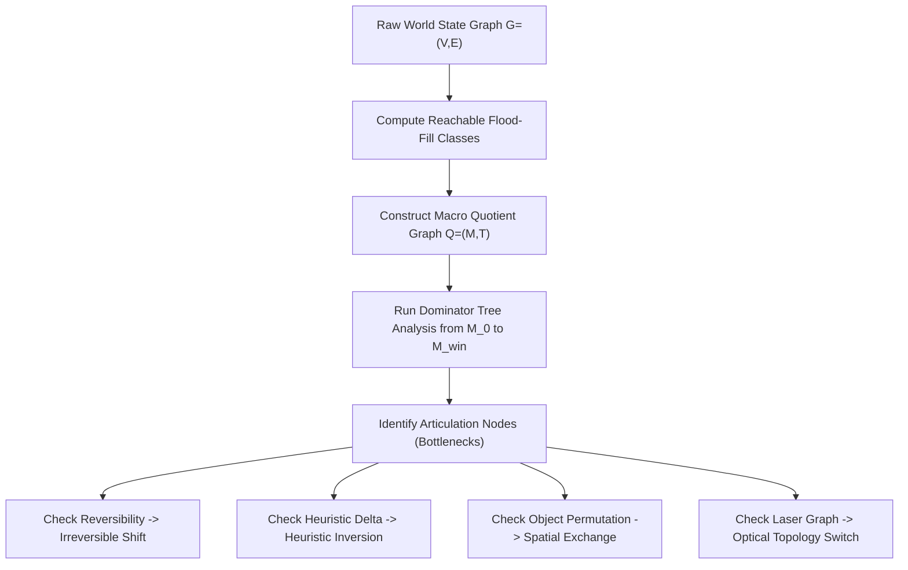

# Puzzle Design Methodology & Solver-Assisted Authoring

This document details how automated solvers are used in modern "thinky" puzzle games (such as **Alan Hazelden / Draknek's** *A Monster's Expedition*, *Sokobond*, *Cosmic Express*, and **Patrick Traynor's** *Patrick's Parabox*) not merely as verification tools, but as **exploratory design instruments** to discover, quantify, and refine "interesting" puzzles.

---

## 1. The Philosophy of Thinky Puzzle Design

In traditional game testing, an automated solver answers a binary question: *"Is this level beatable?"*

In high-end puzzle design, the solver is a creative co-designer that evaluates **puzzle quality**, **idea density**, and **cognitive structure**.

```
  Traditional Solver:       [ Level Draft ] ────────► ( Solvable: Yes/No )

  Design-Assisted Solver:   [ Level Draft ] ────────► ( Epiphany Index           )
                                            ├───────► ( Load-Bearing Factor      )
                                            ├───────► ( Bottlenecks & Milestones )
                                            ├───────► ( Redundancy / Cheese Test )
                                            └───────► ( State Graph Topology     )
```

### Core Design Principles from Draknek & Patrick Traynor

1. **The "Load-Bearing" Rule (Zero Noise)**:
   - In *A Monster's Expedition* and *Patrick's Parabox*, every single block, tree, obstacle, and empty tile in a polished puzzle serves an active purpose.
   - If a block can be removed or frozen into a stationary wall without breaking solvability, it is a "red herring" or accidental noise and should be removed.

2. **The "Aha!" Moment as Heuristic Deception**:
   - Trivial puzzles allow greedy intuition: aiming lasers directly at targets and walking straight forward succeeds.
   - Great puzzles force **heuristic disconnect**: to solve the puzzle, the player must temporarily move away from the goal, rotate a mirror into an apparently backward angle, or park a crate in a counter-intuitive nook.

3. **Idea Density over Board Size**:
   - Great puzzles are physically compact ($5\times 5$ to $8\times 8$) but exhibit rich state-space structures with non-obvious choke points.

---

## 2. Mathematical & Graph Metrics for "Interestingness"

Let the puzzle be modeled as a directed state graph $G = (V, E)$, where each vertex $v \in V$ is a canonical state and each directed edge $e = (u, v) \in E$ is a valid player action.

| Metric | Mathematical Definition | Design Interpretation |
| :--- | :--- | :--- |
| **Epiphany / Deception Score** | $\mathcal{E} = \frac{\text{Expanded Nodes by Greedy Search}}{\text{Optimal Solution Length}}$ | Measures how strongly human "greedy" intuition fails. High ratio = deep epiphany. |
| **Load-Bearing Factor** | $\mathcal{L} = \frac{|\{b \in \text{Bodies} \mid \text{Level without } b \text{ is unsolvable}\}|}{|\text{Bodies}|}$ | $\mathcal{L} = 1.0$ indicates that 100% of blocks on the board are strictly necessary. |
| **Solution Uniqueness & Strategy Divergence** | Number of distinct macro-solution paths | Detects unintended bypasses ("cooks" / "cheeses") vs a single pure intended realization. |
| **Choke Point / Bottleneck Count** | Number of articulation nodes in the Macro Quotient Graph $\mathcal{Q}$ | Measures the number of distinct conceptual milestones / sub-goals in the puzzle. |
| **Dead-End Depth** | $\max_{d} \{ \text{distance to terminal deadlock without winning} \}$ | Indicates how far a player can explore an incorrect idea before realizing it's a dead end. |

---

## 3. Deep Dive: Bottlenecks, Choke Points & Critical Macro States

### 3.1 Micro-States vs. Macro-States (The Quotient Graph)

A raw simulation step in *Laser Potato* is an atomic turn (`Forward`, `TurnLeft`, `TurnRight`, `Backward`, `Interact`). Human players do not reason in raw turns; they reason in **Macro States**.

#### Definition of a Macro State $M$
Two canonical states $u, v \in V$ belong to the same **Macro State** $M$ if and only if:
1. All moveable blocks (mirrors, pushables, lasers, goals) have **identical grid positions and orientations**.
2. The player in state $u$ and state $v$ belongs to the same **connected reachable flood-fill component** without displacing any block.

```
       Micro-State Graph (~10,000 nodes)              Macro Quotient Graph (~25 nodes)
    (Walking, turning, navigating room)            (Actual object pushes & rotations)

       [u1] ──► [u2] ──► [u3] ──► [u4]                     [ M_Start ]
         │        │        │        │                            │
         ▼        ▼        ▼        ▼                            ▼  (Push Mirror A)
       [v1] ──► [v2] ──► [v3] ──► [v4]                       [ M_Phase1 ]
         │                                                       │
         ▼ (Player pushes block)                                 ▼  (Rotate Mirror B)
       [w1] ──► [w2] ──► [w3]                                [ M_Bottleneck ] (Choke Point)
                                                                 │
                                                                 ▼  (Redirect Beam to Goal)
                                                             [ M_Goal ]
```

By collapsing player navigation into reachability equivalence classes, we obtain the **Macro Quotient Graph** $\mathcal{Q} = (\mathcal{M}, \mathcal{T})$, reducing thousands of micro-states to a clean graph of 10–50 meaningful milestones.

---

### 3.2 What Constitutes a "Bottleneck" or "Choke Point"?

In graph theory, a **Choke Point / Articulation Point** in the solution subgraph is a macro-state $M_c \in \mathcal{M}$ through which **every valid winning path must pass**.

If $M_c$ is removed from the reachability graph, the start state $M_0$ and the winning state $M_{\text{win}}$ become disconnected:

$$\forall \text{ valid solution paths } P = (M_0, M_1, \dots, M_k), \quad M_c \in P$$

#### Why Bottlenecks Create Great Puzzles
1. **Pacing and Structure**: Puzzles with 2–4 bottlenecks feel like a journey with clear chapters (e.g. *"First I have to get the mirror out of the corner, then I have to swap positions with the crate, then I can fire the laser"*).
2. **Cognitive Clarity**: When a player reaches a bottleneck, they have a tangible sense of progress because the board has entered a strictly new configuration phase.
3. **No Flailing**: If a puzzle has zero bottlenecks and many wide branching paths to the goal, the player often stumbles into a win accidentally without understanding why.

---

### 3.3 The 4 Archetypes of Critical Macro Moves

When the solver identifies a transition between macro states as a bottleneck, it falls into one of four distinct puzzle archetypes:

```
                          [ The 4 Critical Macro Move Archetypes ]

   1. Irreversible Phase Shift               2. Heuristic Inversion (Detour)
   ┌────────────────────────────────┐        ┌────────────────────────────────┐
   │ [State A] ──► [State B]        │        │ Goal is East.                  │
   │    ▲               │           │        │ Player MUST push crate West to │
   │    └─── (Blocked) ─┘           │        │ clear the laser reflection line│
   │ Push off ledge / one-way gate  │        │ (Heuristic cost temporary rise)│
   └────────────────────────────────┘        └────────────────────────────────┘

   3. Spatial Exchange (Nook Parking)        4. Optical Topology Switching
   ┌────────────────────────────────┐        ┌────────────────────────────────┐
   │ [Mirror A] <──> [Crate B]      │        │ Beam: (X -> Y) ──► (X -> Z)    │
   │ Must swap in a 1-wide corridor │        │ Changing laser route unblocks  │
   │ by using a side alcove.        │        │ player corridor safely.        │
   └────────────────────────────────┘        └────────────────────────────────┘
```

#### 1. The Irreversible Phase Shift (Entropic Transition)
- **Definition**: A move that permanently reduces the set of reachable states (a transition between Strongly Connected Components).
- **Examples**: Pushing a block off a ledge, dropping a block into a pit to build a bridge, or pushing a block past a one-way laser barrier.
- **Design Impact**: High tension. The player must be certain of the move before committing.

#### 2. The Heuristic Inversion (The "Sacrifice" / "Detour")
- **Definition**: A transition where standard goal-distance heuristics $h(s)$ strictly **increase** (the board looks *further* from winning), but this move is the *only* edge leading to the solution component.
- **Examples**: Pushing a mirror away from the laser beam, or temporarily blocking an active goal to maneuver behind a block.
- **Design Impact**: This produces the strongest **"Aha!" moment** because standard human greedy reasoning rejects this move initially.

#### 3. Spatial Exchange / Congestion Choke Point
- **Definition**: Two or more moveable objects must swap relative spatial order within a constrained topology.
- **Examples**: Two blocks in a 1-tile wide hallway where the player must park one block in an alcove, walk around or push past, and pull/push the second block through.
- **Design Impact**: Tests pure spatial planning and sequencing without requiring complex rules.

#### 4. Optical Topology Switch (Laser Re-routing)
- **Definition**: A macro action that alters the laser beam network graph from one cycle/tree topology to another.
- **Examples**: Rotating a mirror so the beam cuts off a path previously walked on, but unlocks a door/goal on the other side of the room.
- **Design Impact**: Distinctive to *Laser Potato*; integrates the optical mechanics directly with physical movement.

---

## 4. How the Solver Automatically Classifies Insights

The *Laser Potato* solver can automatically detect and label these milestones using the following algorithmic pipeline:



### Algorithmic Pipeline:
1. **Macro Collapse**: Map each visited micro-state $v \in V$ to a `MacroStateId` based on $( \text{moveable\_bodies\_fingerprint}, \text{player\_reachability\_partition} )$.
2. **Dominator Tree on $\mathcal{Q}$**: Compute the dominators of $M_{\text{win}}$ with root $M_0$. Every node on the dominator path is a strict choke point.
3. **Branching Entropy Calculation**:
   $$\mathcal{H}(M) = - \sum_{i=1}^{k} p_i \log_2(p_i)$$
   where $p_i$ is the probability that random exploration from macro-branch $i$ reaches the winning state. When $\mathcal{H}(M) \to 0$, the player is forced through a singular critical move.
4. **Insight Profiler Report**: The solver outputs a timeline of milestones for the level designer:
   - *Milestone 1 (Step 4)*: Spatial Exchange – Park Mirror in nook at $(3, 1, 0)$.
   - *Milestone 2 (Step 9)*: Heuristic Inversion – Detour Crate away from target.
   - *Milestone 3 (Step 16)*: Optical Switch – Laser routed to Goal Pyramid.

---

## 5. Next Evolution for *Laser Potato* Solver

| Feature | Purpose |
| :--- | :--- |
| **1. Level Quality & Epiphany Report** | Instant editor report showing Epiphany Score, Bottleneck Count, and Load-Bearing Factor. |
| **2. Redundancy & Cheese Diagnostic** | Highlights unnecessary blocks or unintended shortcut solutions. |
| **3. Auto-Minimizer** | Automatically simplifies walls and shrinks rooms to find the minimal essence of a puzzle. |
| **4. Perturbation Discovery Engine** | Generates novel puzzle variants by perturbing mirror angles/positions and filtering for high epiphany scores. |
